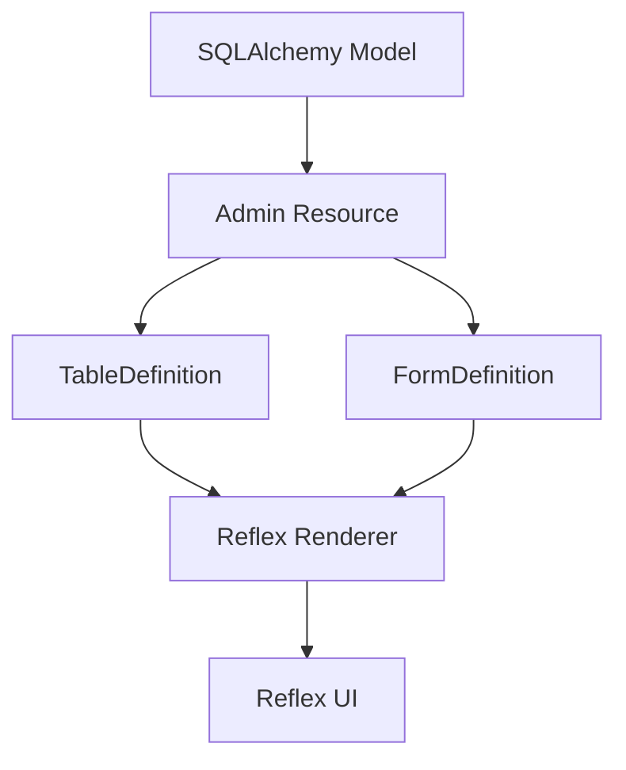

# Architecture (short)

This POC splits responsibilities clearly:

- Core (semantic):
  - Resource, FieldDefinition, TableDefinition, FormDefinition, FilterExpression, Action.
  - No Reflex imports. Domain-only.

- Data adapter:
  - SQLAlchemy introspection, Query adapters (search/sort/pagination), CRUD.

- Renderer:
  - Reflex renderer wraps the semantic model into Reflex components.
  - Renderer is optional and pluggable; core types are renderer-agnostic.

Mermaid diagram:

Design notes:
- SQLAlchemy remains the persistence layer.
- Pydantic is used for validation when schemas are provided.
- Query operations (search/sort/paginate/filter) execute in DB.
- Keep code simple and explicit.
